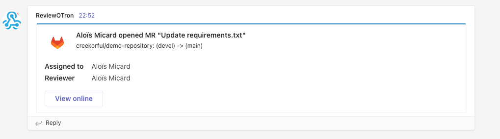
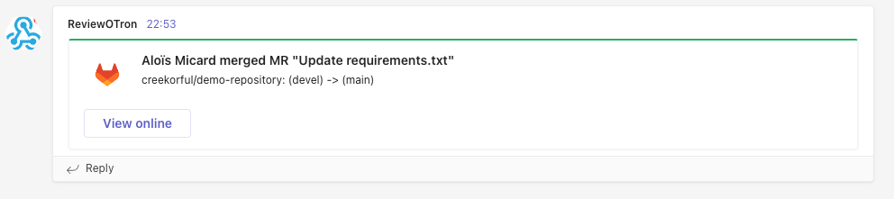
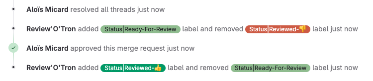

# review-o-tron

Homemade PR bot for [Gitlab](https://gitlab.com/). 

Used by [VOLD](https://www.vold.lu) internaly to monitor new PRs as well as auto classify MRs based on criterias.

## What's in the box?

### Microsoft team notifications

MS team notification can be configured using `TEAMS_WEBHOOK_URL` env variable.

Get notified when a new MR is opened within your projects.

Get notified when a MR is merged within your projects.

### Auto apply labels based on status

Review'o'tron can automatically apply configurable label based on current MR status. This enables easy filtering.

### Auto apply labels based on size

Review'o'tron can automatically apply configurable label based on current MR size. This allows team to plan review with efficiency. 

