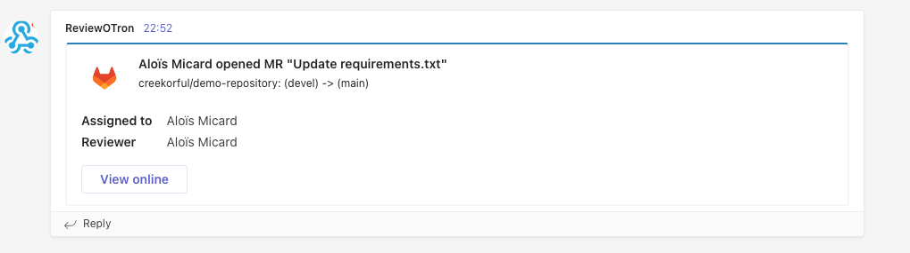

# review-o-tron

Homemade PR bot for [Gitlab](https://gitlab.com/). 

Used by [VOLD](https://www.vold.lu) internaly to monitor new PRs as well as auto classify PRs based on criterias.

## What's in the box?

### Microsoft team notifications

MS team notification can be configured using `TEAMS_WEBHOOK_URL` env variable.

Get notified when a new PR is opened within your projects.

Get notified when a PR is merged within your projects.

